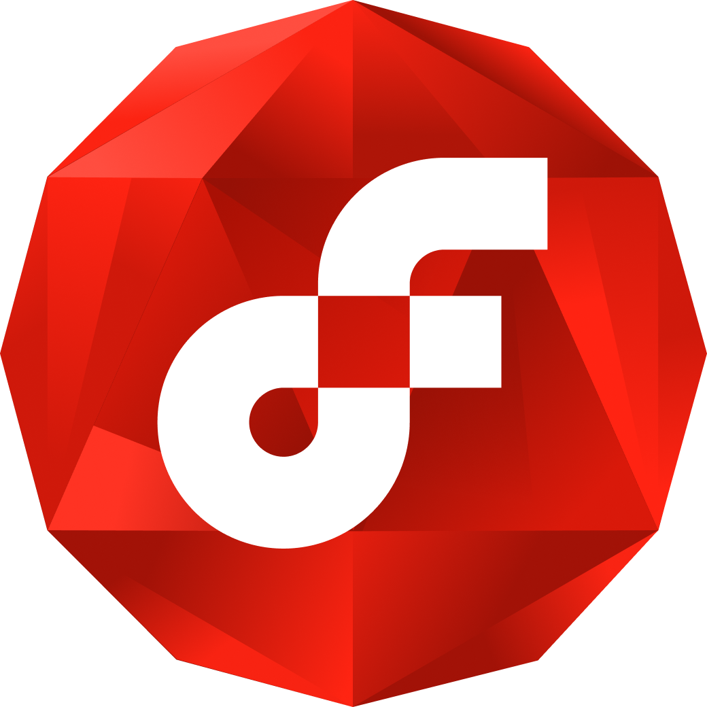

<br />
<div align="center">
  <a href="">
    
  </a>
  <p align="center"> <br />
    <a href=""><strong>View on GitHub »</strong></a> <br /><br />
    <a href="https://docs.onflow.org/sdk-guidelines/">SDK Specifications</a> ·
    <a href="">Contribute</a> ·
    <a href="">Report a Bug</a>
  </p>
</div><br />

## Overview 

This reference documents all the methods available in the SDK, and explains in detail how these methods work.
SDKs are open source, and you can use them according to the licence.

The library client specifications can be found here:

// TODO specs here
[]()


## Getting Started

### Installing

```bash
gem install flow_client
```

Or using Bundler

```bash
gem 'flow_client'
```

### Importing the Library

```ruby
require 'flow_client'
```

## Connect
[]() // TODO specs here

The library uses gRPC to communicate with the access nodes and it must be configured with correct access node API URL. 

📖 **Access API URLs** can be found [here](https://docs.onflow.org/access-api/#flow-access-node-endpoints). An error will be returned if the host is unreachable.
The Access Nodes APIs hosted by DapperLabs are accessible at:
- Testnet `access.devnet.nodes.onflow.org:9000`
- Mainnet `access.mainnet.nodes.onflow.org:9000`
- Local Emulator `127.0.0.1:3569` 

Example:

```ruby
client = FlowClient::Client.new("access.devnet.nodes.onflow.org:9000")
res = client.ping
```
## Querying the Flow Network
After you have established a connection with an access node, you can query the Flow network to retrieve data about blocks, accounts, events and transactions. We will explore how to retrieve each of these entities in the sections below.

### Get Blocks
[]() // TODO specs here

Query the network for block by id, height or get the latest block.

📖 **Block ID** is SHA3-256 hash of the entire block payload. This hash is stored as an ID field on any block response object (ie. response from `GetLatestBlock`). 

📖 **Block height** expresses the height of the block on the chain. The latest block height increases by one for every valid block produced.

#### Examples

This example depicts ways to get the latest block as well as any other block by height or ID:

```ruby
latest_block = client.get_latest_block
```

```ruby
id = client.get_latest_block.id
block = client.get_block_by_id(id)
```

```ruby
height = client.get_latest_block.height
block = client.get_block_by_height(height)
```

Result output:
```ruby
#<FlowClient::Block:0x00007faf13343928
 @block_seals=[#<FlowClient::BlockSeal:0x00007faf13340b38 @block_id="306155440eabad2296bec00804f896eb29866f6d4a3a508ec08d233b4951f0da", @execution_receipt_id="79f37a11f3cdeb5ad43a014961b0f6411f36ec5e5c8a4ce6a39395dc6e010a7e", @execution_receipt_signatures=[], @result_approval_signatures=[]>],
 @collection_guarantees=
  [#<FlowClient::CollectionGuarantee:0x00007faf13342550 @collection_id="4fad4fd2cce61825102343dfb1d271e1884a72b3a97a01edbcb787b97c82055d", @signatures=["b2a76b5ad5d202438881e3ae5350a037cb1dbc11a2e3c2e359a62e52715685cde99d3635904381db831e471f49abf7a7"]>,
   #<FlowClient::CollectionGuarantee:0x00007faf13341da8 @collection_id="fd414c7466bc72ad7bb62bb94760105d6c5724fe16b0f25de5b38ed80d06b213", @signatures=["801cdac059686a29c4258c004e40c8bbcc88ce6ce626a0e85664cdf3e77ec9d326bdecf734f826ab48409005b8dfda97"]>,
   #<FlowClient::CollectionGuarantee:0x00007faf133415d8 @collection_id="c5482e4162d13308f0603c12924c5fe1efde924ab59bb1fe2bd5d7aaf475bf44", @signatures=["851c5dd521b4567029cfaa9ee3bbc6065ed205ae17ac7480f97887f97dea2fdc176c2acf70f9a97338498ecec07d428c"]>],
 @height=49992170,
 @id="7034b19b6d11b1b078f6d12bba557c923d21681603c0168e9cd32661edb667cb",
 @parent_id="c0cd19c8c6ce5a8170f8a8776dc66c4e697741150115fb4ad0a3b91d8def0672",
 @signatures=["919f93cb66f11f88b86aec9e89cbb66aebe5846a9246f04661cf9094c8bb5e1e7e89da3f0d688b0e27b31cec551f2f89aa755aabed5b44ba0c2cc6e87c72eba2a33d64219df0ee4185ed9ce78f77721d519f3c6bebe0c95bffc9a98ff706001d"],
 @timestamp=2021-11-03 09:00:38.000037 +0200>
```

### Get Account
[]() // TODO specs here

Retrieve any account from Flow network's latest block or from a specified block height.

📖 **Account address** is a unique account identifier. Be mindful about the `0x` prefix, you should use the prefix as a default representation but be careful and safely handle user inputs without the prefix.

An account includes the following data:
- Address: the account address.
- Balance: balance of the account.
- Contracts: list of contracts deployed to the account.
- Keys: list of keys associated with the account.

#### Examples
Example depicts ways to get an account at the latest block and at a specific block height:

```ruby
account = client.get_account("0x01")
```
Result output:
```ruby
// TODO get account result
```


### Get Transactions
[]() // TODO specs here

Retrieve transactions from the network by providing a transaction ID. After a transaction has been submitted, you can also get the transaction result to check the status.

📖 **Transaction ID** is a hash of the encoded transaction payload and can be calculated before submitting the transaction to the network.

⚠️ The transaction ID provided must be from the current spork.

📖 **Transaction status** represents the state of transaction in the blockchain. Status can change until is finalized.

| Status      | Final | Description |
| ----------- | ----------- | ----------- |
|   UNKNOWN    |    ❌   |   The transaction has not yet been seen by the network  |
|   PENDING    |    ❌   |   The transaction has not yet been included in a block   |
|   FINALIZED    |   ❌     |  The transaction has been included in a block   |
|   EXECUTED    |   ❌    |   The transaction has been executed but the result has not yet been sealed  |
|   SEALED    |    ✅    |   The transaction has been executed and the result is sealed in a block  |
|   EXPIRED    |   ✅     |  The transaction reference block is outdated before being executed    |


**[]()** // TODO example link
```ruby
transaction = client.get_transaction("d46e54de8c34dfe58a22c15d24689d1ad255f67bb9868605fcac28417aa54a37")
```

```ruby
#<FlowClient::Transaction:0x00007fad65ad54e8
 @address_aliases={},
 @arguments=[],
 @authorizer_addresses=["8940baba1178d9ab"],
 @envelope_signatures=[#<FlowClient::Signature:0x00007fad65ad4b10 @address="8940baba1178d9ab", @key_id=0, @signature="36260a6ea5c487c3b68becb6d88e012a8b25b76a0835881281c4ee37a56eeafad7bce02a4bbe8f0123e7a4e6866143aecae348dc5ad7fdebb7cb2a54757ba950">],
 @gas_limit=9999,
 @payer_address="8940baba1178d9ab",
 @payload_signatures=[],
 @proposal_key=#<FlowClient::ProposalKey:0x00007fad65acfd18 @address="8940baba1178d9ab", @key_id=0, @sequence_number=135>,
 @proposer_address=nil,
 @proposer_key_index=0,
 @proposer_key_sequence_number=0,
 @reference_block_id="8f483b7c18ca1f52ee55777b612b61dfbd2f07584db9209b1441d6fbdf31fc51",
 @script=
  "import NonFungibleToken from 0x631e88ae7f1d7c20\nimport SturdyItems from 0xfafb022e4e45634b\n\n// This transaction configures an account to hold Sturdy Items.\n\ntransaction {\n    prepare(signer: AuthAccount) {\n    \n   \t\tlog(\"Hello, World!\")\n        log(signer.address)\n        // if the account doesn't already have a collection\n        if signer.borrow<&SturdyItems.Collection>(from: SturdyItems.CollectionStoragePath) == nil {\n\n            // create a new empty collection\n            let collection <- SturdyItems.createEmptyCollection()\n            \n            // save it to the account\n            signer.save(<-collection, to: SturdyItems.CollectionStoragePath)\n\n            // create a public capability for the collection\n            signer.link<&SturdyItems.Collection{NonFungibleToken.CollectionPublic, SturdyItems.SturdyItemsCollectionPublic}>(SturdyItems.CollectionPublicPath, target: SturdyItems.CollectionStoragePath)\n        }\n    }\n}",
 @signers={}>
```

```ruby
transaction_result = client.get_transaction_result("84c8732a6cef4b66e74cef4492af9fadd3379b9d8a31b97217c5b81640288424")
```

Example output:
```bash
// TODO example output
```


### Get Events
[]() // TODO specs here

Retrieve events by a given type in a specified block height range or through a list of block IDs.

📖 **Event type** is a string that follow a standard format:
```
A.{contract address}.{contract name}.{event name}
```

Please read more about [events in the documentation](https://docs.onflow.org/core-contracts/flow-token/). The exception to this standard are 
core events, and you should read more about them in [this document](https://docs.onflow.org/cadence/language/core-events/).

📖 **Block height range** expresses the height of the start and end block in the chain.

#### Examples
Example depicts ways to get events within block range or by block IDs:

```ruby
# get_events(type, start_height, end_height)
res = client.get_events("A.7e60df042a9c0868.FlowToken.TokensWithdrawn", 50157100, 50157101)
```
Example output:
```ruby
[#<FlowClient::EventsResult:0x00007fad65b8fd98 @block_height=50157100, @block_id="d46e54de8c34dfe58a22c15d24689d1ad255f67bb9868605fcac28417aa54a37", @block_timestamp=2021-11-05 09:56:02.00021 +0200, @events=[]>,
 #<FlowClient::EventsResult:0x00007fad65b8f7f8
  @block_height=50157101,
  @block_id="b0dd0496857b21b22711c623135eb9ebe7640f3dec45ce2a64971ffe03446b5e",
  @block_timestamp=2021-11-05 09:56:03.000031 +0200,
  @events=
   [#<FlowClient::Event:0x00007fad65b8f050
     @event_index=0,
     @payload="{\"type\":\"Event\",\"value\":{\"id\":\"A.7e60df042a9c0868.FlowToken.TokensWithdrawn\",\"fields\":[{\"name\":\"amount\",\"value\":{\"type\":\"UFix64\",\"value\":\"0.00001000\"}},{\"name\":\"from\",\"value\":{\"type\":\"Optional\",\"value\":{\"type\":\"Address\",\"value\":\"0xfafb022e4e45634b\"}}}]}}\n",
     @transaction_id="30c93926fb310c53ab6d29f092fd774c8a3642f6ca018a7ba25dcae553d720b2",
     @transaction_index=0,
     @type="A.7e60df042a9c0868.FlowToken.TokensWithdrawn">,
    #<FlowClient::Event:0x00007fad65b8eba0
     @event_index=2,
     @payload="{\"type\":\"Event\",\"value\":{\"id\":\"A.7e60df042a9c0868.FlowToken.TokensWithdrawn\",\"fields\":[{\"name\":\"amount\",\"value\":{\"type\":\"UFix64\",\"value\":\"0.00001000\"}},{\"name\":\"from\",\"value\":{\"type\":\"Optional\",\"value\":{\"type\":\"Address\",\"value\":\"0x1bc62b2c04dfd147\"}}}]}}\n",
     @transaction_id="5ee3317deb31413135521486a07f040fc34aeba41adf99e6ebd7770716cd6b29",
     @transaction_index=1,
     @type="A.7e60df042a9c0868.FlowToken.TokensWithdrawn">]>]
```

### Get Collections
[]() // TODO specs here

Retrieve a batch of transactions that have been included in the same block, known as ***collections***. 
Collections are used to improve consensus throughput by increasing the number of transactions per block and they act as a link between a block and a transaction.

📖 **Collection ID** is SHA3-256 hash of the collection payload.

Example retrieving a collection:
```ruby
# cid = "..."
client.get_collection_by_id(cid)
```
Example output:
```bash
// TODO collection example
```

### Execute Scripts
[]() // TODO specs here

Scripts allow you to write arbitrary non-mutating Cadence code on the Flow blockchain and return data. You can learn more about [Cadence and scripts here](https://docs.onflow.org/cadence/language/), but we are now only interested in executing the script code and getting back the data.

We can execute a script using the latest state of the Flow blockchain or we can choose to execute the script at a specific time in history defined by a block height or block ID.

📖 **Block ID** is SHA3-256 hash of the entire block payload, but you can get that value from the block response properties.

📖 **Block height** expresses the height of the block in the chain.

```ruby
# Simple script
script = %{
  pub fun main(a: Int): Int {
    return a + 10
  }
}

args = [{ type: 'Int', value: "1" }.to_json]
res = client.execute_script(script, args)
```

```ruby
# Complex script
script = %{
  pub struct User {
      pub var balance: UFix64
      pub var address: Address
      pub var name: String

      init(name: String, address: Address, balance: UFix64) {
          self.name = name
          self.address = address
          self.balance = balance
      }
  }

  pub fun main(name: String): User {
      return User(
          name: name,
          address: 0x1,
          balance: 10.0
      )
  }
}

args = [{ type: 'String', value: "Holy Batman" }.to_json]
res = client.execute_script(script, args)
```

Example output:
```bash
// TODO example output
```

## Mutate Flow Network
Flow, like most blockchains, allows anybody to submit a transaction that mutates the shared global chain state. A transaction is an object that holds a payload, which describes the state mutation, and one or more authorizations that permit the transaction to mutate the state owned by specific accounts.

Transaction data is composed and signed with help of the SDK. The signed payload of transaction then gets submitted to the access node API. If a transaction is invalid or the correct number of authorizing signatures are not provided, it gets rejected. 

Executing a transaction requires couple of steps:
- [Building a transaction](#build-transactions).
- [Signing a transaction](#sign-transactions).
- [Sending a transaction](#send-transactions).

## Transactions
A transaction is nothing more than a signed set of data that includes script code which are instructions on how to mutate the network state and properties that define and limit it's execution. All these properties are explained bellow. 

📖 **Script** field is the portion of the transaction that describes the state mutation logic. On Flow, transaction logic is written in [Cadence](https://docs.onflow.org/cadence/). Here is an example transaction script:
```
transaction(greeting: String) {
  execute {
    log(greeting.concat(", World!"))
  }
}
```

📖 **Arguments**. A transaction can accept zero or more arguments that are passed into the Cadence script. The arguments on the transaction must match the number and order declared in the Cadence script. Sample script from above accepts a single `String` argument.

📖 **[Proposal key](https://docs.onflow.org/concepts/transaction-signing/#proposal-key)** must be provided to act as a sequence number and prevent reply and other potential attacks.

Each account key maintains a separate transaction sequence counter; the key that lends its sequence number to a transaction is called the proposal key.

A proposal key contains three fields:
- Account address
- Key index
- Sequence number

A transaction is only valid if its declared sequence number matches the current on-chain sequence number for that key. The sequence number increments by one after the transaction is executed.

📖 **[Payer](https://docs.onflow.org/concepts/transaction-signing/#signer-roles)** is the account that pays the fees for the transaction. A transaction must specify exactly one payer. The payer is only responsible for paying the network and gas fees; the transaction is not authorized to access resources or code stored in the payer account.

📖 **[Authorizers](https://docs.onflow.org/concepts/transaction-signing/#signer-roles)** are accounts that authorize a transaction to read and mutate their resources. A transaction can specify zero or more authorizers, depending on how many accounts the transaction needs to access.

The number of authorizers on the transaction must match the number of AuthAccount parameters declared in the prepare statement of the Cadence script.

Example transaction with multiple authorizers:
```
transaction {
  prepare(authorizer1: AuthAccount, authorizer2: AuthAccount) { }
}
```

📖 **Gas limit** is the limit on the amount of computation a transaction requires, and it will abort if it exceeds its gas limit.
Cadence uses metering to measure the number of operations per transaction. You can read more about it in the [Cadence documentation](/cadence).

The gas limit depends on the complexity of the transaction script. Until dedicated gas estimation tooling exists, it's best to use the emulator to test complex transactions and determine a safe limit.

📖 **Reference block** specifies an expiration window (measured in blocks) during which a transaction is considered valid by the network.
A transaction will be rejected if it is submitted past its expiry block. Flow calculates transaction expiry using the _reference block_ field on a transaction.
A transaction expires after `600` blocks are committed on top of the reference block, which takes about 10 minutes at average Mainnet block rates.

### Build Transactions
[]() // TODO specs here

Building a transaction involves setting the required properties explained above and producing a transaction object. 

Here we define a simple transaction script that will be used to execute on the network and serve as a good learning example.

```
transaction(greeting: String) {

  let guest: Address

  prepare(authorizer: AuthAccount) {
    self.guest = authorizer.address
  }

  execute {
    log(greeting.concat(",").concat(guest.toString()))
  }
}
```

**[]()** // TODO example link
```ruby
cadence = %{
  transaction(greeting: String) {

    let guest: Address

    prepare(authorizer: AuthAccount) {
      self.guest = authorizer.address
    }

    execute {
      log(greeting.concat(",").concat(guest.toString()))
    }
  }
}

arguments = [{ type: "String", value: "Hello world!" }.to_json]

transaction = FlowClient::Transaction.new
transaction.script = cadence
transaction.reference_block_id = client.get_latest_block.id
transaction.gas_limit = 100
transaction.arguments = arguments
```

After you have successfully [built a transaction](#build-transactions) the next step in the process is to sign it.

### Sign Transactions
[]() // TODO specs here

Flow introduces new concepts that allow for more flexibility when creating and signing transactions.
Before trying the examples below, we recommend that you read through the [transaction signature documentation](https://docs.onflow.org/concepts/accounts-and-keys/).

After you have successfully [built a transaction](#build-transactions) the next step in the process is to sign it. Flow transactions have envelope and payload signatures, and you should learn about each in the [signature documentation](https://docs.onflow.org/concepts/accounts-and-keys/#anatomy-of-a-transaction).

Quick example of building a transaction:
```ruby
arguments = [{ type: "String", value: "Hello world!" }.to_json]

transaction = FlowClient::Transaction.new
transaction.script = cadence
transaction.reference_block_id = client.get_latest_block.id
transaction.gas_limit = 100
transaction.arguments = arguments
```

Signatures can be generated more securely using keys stored in a hardware device such as an [HSM](https://en.wikipedia.org/wiki/Hardware_security_module). The `crypto.Signer` interface is intended to be flexible enough to support a variety of signer implementations and is not limited to in-memory implementations.

Simple signature example:
```ruby
transaction.proposer_address = new_account.address
transaction.proposer_key_index = new_account.keys[0].index
transaction.proposer_key_sequence_number = new_account.keys[0].sequence_number
transaction.payer_address = new_account.address
transaction.authorizer_addresses = [new_account.address]
transaction.add_envelope_signature(new_account.address, new_account.keys[0].index, auth_signer_one)
```

Flow supports great flexibility when it comes to transaction signing, we can define multiple authorizers (multi-sig transactions) and have different payer account than proposer. We will explore advanced signing scenarios bellow.

### [Single party, single signature](https://docs.onflow.org/concepts/transaction-signing/#single-party-single-signature)

- Proposer, payer and authorizer are the same account (`0x01`).
- Only the envelope must be signed.
- Proposal key must have full signing weight.

| Account | Key ID | Weight |
| ------- | ------ | ------ |
| `0x01`  | 1      | 1.0    |

**[](https://github.com/onflow/flow-go-sdk/tree/master/examples#single-party-single-signature)**
```ruby
account = client.get_account("f8d6e0586b0a20c7")

arguments = [{ type: "String", value: "Hello world!" }.to_json]

transaction = FlowClient::Transaction.new
transaction.script = script
transaction.reference_block_id = client.get_latest_block.id
transaction.gas_limit = 100
transaction.proposer_address = account.address
transaction.proposer_key_index = account.keys.first.index
transaction.arguments = arguments
transaction.proposer_key_sequence_number = account.keys.first.sequence_number
transaction.payer_address = ccount.address
transaction.authorizer_addresses = [ccount.address]

# Only the envelope needs to be signed in this special case
signer = FlowClient::LocalSigner.new("4d9287571c8bff7482ffc27ef68d5b4990f9bd009a1e9fa812aae08ba167d57f")
transaction.add_envelope_signature(account.address, account.keys.first.index, signer)

tx = client.send_transaction(transaction)
client.wait_for_transaction(tx.id.unpack1("H*")) do |result|
  puts result.inspect
end
```


### [Single party, multiple signatures](https://docs.onflow.org/concepts/transaction-signing/#single-party-multiple-signatures)

- Proposer, payer and authorizer are the same account (`0x01`).
- Only the envelope must be signed.
- Each key has weight 0.5, so two signatures are required.

| Account | Key ID | Weight |
| ------- | ------ | ------ |
| `0x01`  | 1      | 0.5    |
| `0x01`  | 2      | 0.5    |

**[](https://github.com/onflow/flow-go-sdk/tree/master/examples#single-party-multiple-signatures)**
```
// TODO example
```

### [Multiple parties](https://docs.onflow.org/concepts/transaction-signing/#multiple-parties)

- Proposer and authorizer are the same account (`0x01`).
- Payer is a separate account (`0x02`).
- Account `0x01` signs the payload.
- Account `0x02` signs the envelope.
    - Account `0x02` must sign last since it is the payer.

| Account | Key ID | Weight |
| ------- | ------ | ------ |
| `0x01`  | 1      | 1.0    |
| `0x02`  | 3      | 1.0    |

**[](https://github.com/onflow/flow-go-sdk/tree/master/examples#multiple-parties)**
```
// TODO example
```

### [Multiple parties, two authorizers](https://docs.onflow.org/concepts/transaction-signing/#multiple-parties)

- Proposer and authorizer are the same account (`0x01`).
- Payer is a separate account (`0x02`).
- Account `0x01` signs the payload.
- Account `0x02` signs the envelope.
    - Account `0x02` must sign last since it is the payer.
- Account `0x02` is also an authorizer to show how to include two AuthAccounts into an transaction

| Account | Key ID | Weight |
| ------- | ------ | ------ |
| `0x01`  | 1      | 1.0    |
| `0x02`  | 3      | 1.0    |

**[](https://github.com/onflow/flow-go-sdk/tree/master/examples#multiple-parties-two-authorizers)**
```
// TODO example
```

### [Multiple parties, multiple signatures](https://docs.onflow.org/concepts/transaction-signing/#multiple-parties)

- Proposer and authorizer are the same account (`0x01`).
- Payer is a separate account (`0x02`).
- Account `0x01` signs the payload.
- Account `0x02` signs the envelope.
    - Account `0x02` must sign last since it is the payer.
- Both accounts must sign twice (once with each of their keys).

| Account | Key ID | Weight |
| ------- | ------ | ------ |
| `0x01`  | 1      | 0.5    |
| `0x01`  | 2      | 0.5    |
| `0x02`  | 3      | 0.5    |
| `0x02`  | 4      | 0.5    |

**[]()** // TODO example link
```
// TODO example
```


### Send Transactions
[]() // TODO reference here

After a transaction has been [built](#build-transactions) and [signed](#sign-transactions), it can be sent to the Flow blockchain where it will be executed. If sending was successful you can then [retrieve the transaction result](#get-transactions).


**[]()** // TODO example here
```
// TODO send transaction example
```


### Create Accounts
[]() // TODO reference here

On Flow, account creation happens inside a transaction. Because the network allows for a many-to-many relationship between public keys and accounts, it's not possible to derive a new account address from a public key offline. 

The Flow VM uses a deterministic address generation algorithm to assigen account addresses on chain. You can find more details about address generation in the [accounts & keys documentation](https://docs.onflow.org/concepts/accounts-and-keys/).

#### Public Key
Flow uses ECDSA key pairs to control access to user accounts. Each key pair can be used in combination with the SHA2-256 or SHA3-256 hashing algorithms.

⚠️ You'll need to authorize at least one public key to control your new account.

Flow represents ECDSA public keys in raw form without additional metadata. Each key is a single byte slice containing a concatenation of its X and Y components in big-endian byte form.

A Flow account can contain zero (not possible to control) or more public keys, referred to as account keys. Read more about [accounts in the documentation](https://docs.onflow.org/concepts/accounts-and-keys/#accounts).

An account key contains the following data:
- Raw public key (described above)
- Signature algorithm
- Hash algorithm
- Weight (integer between 0-1000)

Account creation happens inside a transaction, which means that somebody must pay to submit that transaction to the network. We'll call this person the account creator. Make sure you have read [sending a transaction section](#send-transactions) first. 

```ruby
client.create_account
```

After the account creation transaction has been submitted you can retrieve the new account address by [getting the transaction result](#get-transactions). 

The new account address will be emitted in a system-level `flow.AccountCreated` event.

```
// TODO get new account address
```

### Generate Keys
[]() // TODO reference here

Flow uses [ECDSA](https://en.wikipedia.org/wiki/Elliptic_Curve_Digital_Signature_Algorithm) signatures to control access to user accounts. Each key pair can be used in combination with the `SHA2-256` or `SHA3-256` hashing algorithms.

Here's how to generate an ECDSA private key for the P-256 (secp256r1) curve.

```ruby
# Supported ECC curves are:
# FlowClient::Crypto::Curves::P256
# FlowClient::Crypto::Curves::SECP256K1

private_key, public_key = FlowClient::Crypto.generate_key_pair(FlowClient::Crypto::Curves::P256)
```

The example above uses an ECDSA key pair on the P-256 (secp256r1) elliptic curve. Flow also supports the secp256k1 curve used by Bitcoin and Ethereum. Read more about [supported algorithms here](https://docs.onflow.org/concepts/accounts-and-keys/#supported-signature--hash-algorithms).

```ruby
private_key, public_key = FlowClient::Crypto.generate_key_pair(FlowClient::Crypto::Curves::SECP256K1)
```
